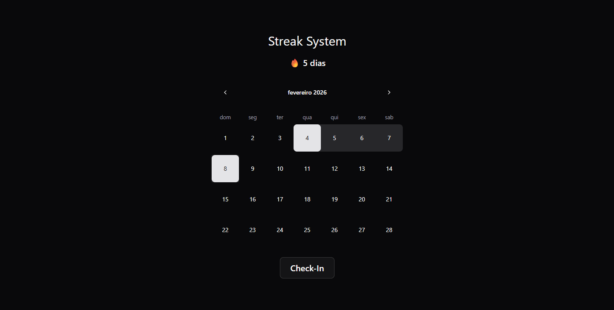

# 🔥 Streak Calendar

Um sistema moderno de rastreamento de hábitos com calendário interativo, construído com React e design minimalista. Acompanhe suas sequências diárias e mantenha-se motivado! 



## ✨ Características

- 🔥 **Sistema de Streaks**: Contador automático de dias consecutivos
- 📅 **Calendário Não-Clicável**: Interface controlada apenas por código para garantir integridade dos dados
- 🎨 **UI Moderna**: Componentes do shadcn/ui com Tailwind CSS
- 🌙 **Tema Escuro**: Interface elegante e confortável para os olhos
- 💾 **Persistência Local**: Dados salvos no Local Storage do navegador
- 📱 **Responsivo**: Experiência perfeita em qualquer dispositivo

## 🚀 Tech Stack

- **Framework**: [React 18](https://react.dev/)
- **Build Tool**: [Vite](https://vitejs.dev/)
- **Styling**: [Tailwind CSS](https://tailwindcss.com/)
- **Components**: [shadcn/ui](https://ui.shadcn.com/)
- **Storage**: Local Storage API
- **Language**: JavaScript/JSX

## 🛠️ Instalação e Setup

### Pré-requisitos

- Node.js 16+ instalado
- npm ou yarn

### Passos

1. **Clone o repositório**:
```bash
git clone https://github.com/seu-usuario/streak-calendar.git
cd streak-calendar
```

2. **Instale as dependências**:
```bash
npm install
# ou
yarn install
```

3. **Inicie o servidor de desenvolvimento**:
```bash
npm run dev
# ou
yarn dev
```

4. **Abra no navegador**:
```
http://localhost:5173
```

## 💡 Como Usar

### Interface do Usuário

1. **Navegação**: Use as setas laterais para navegar entre meses
2. **Check-in Diário**: Clique no botão "Check-In" para marcar o dia atual
3. **Visualização de Streak**: Veja sua sequência atual no topo com o ícone 🔥

## 👨‍💻 Autor

**Emanuel Henrique** - [GitHub](https://github.com/emanuel-henrique) | [LinkedIn](https://www.linkedin.com/in/emanuel-henrique-38b264392/)

## 📝 Sobre o Projeto

Projeto desenvolvido com o intuito de estudar sobre um funcionalidade, a qual será novamente utilizada em projetos posteriores.
